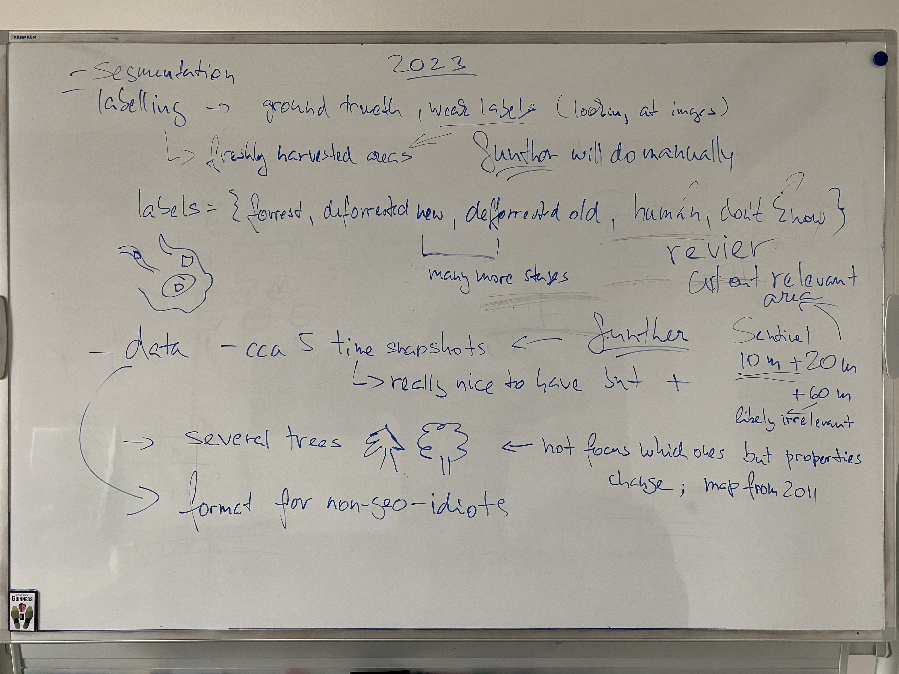

# MSc lifetime

Created: MG 2024-02-19

This readme shall keep tracks of meetings, outcomes and todos.
General admin docs related to the MSc thesis can be added to the folder.

## 2024-04-24
- Make sure the data is in a suitable form for the loss calculation
- Use a smaller ResNet backbone (e.g. ResNet-50) for the Deeplabv2  model training
- Is deeplabv2 from torch vision pretrained? Using pretrained model or from scratch?
- Take into consideration the weather season of the images. Create a new channel and assign it a unique int value through all pixels of the image for each time stamp
- A new channel where the set deforested is split into subset based on the vegetation cover of the pixel
- This new mask channel could be regarded as a regression task 0:invalid 1:soil, 2:low grass, 3:high grass, 4:partial tress, 5:forest
- Define the loss by removing the invalid pixels (i.e. mask =0). This results in a faster and easier learning network
- Structure of code 

## 2024-03-05
- Changes to the thesis proposal reagrding the scope of the thesis and the proposed methodology
- Working procedures
  - Progress meeting every Monday 10:00-11:00
  - EA was allocated a workplace in CAIRO
- TODO EA:
  - New proposal: should be done by Friday 08.03.2024
- Meeting details: 
  

## 2024-02-27 - meeting at Greenspin
- agreed to focus on forrestation Bavaria
- data will come from Greenpsin pre-process in a format easy to work for us (circe end of March)
- working procedures:
  - progress meetings cca every 2 weeks
  - Esther preferably working from CAIRO offices but Greenspin available for Q&A 
- TODO AE:
  - prepare project proposal
  - read and follow upon todos from 2024-02-21
- meeting details: 

## 2024-02-21
- the story about Amazon rainforest needs to change to some other cause Max has dropped out from the supervision
- TODO MG: speak to Greenspin to find another application and secure the data
- The MSc thesis proposal need updates
  - related work - build more on the 3 lit links in the announcement
  - from the current papers in the proposal:
    - SLIC Superpixel - important to understand and should remain
    - U-Net - standard in segmentation, needs to remain
    - SegNet - probably a useful baseline 
  - methodology - needs updating, should focus on 2 strategies
    - A) using existing pre-trained models
      - how to bring multi-spectral data (many channels) to 3 input-channel models
      - natural images have other properties than satellite data - how to tackle
    - B) pre-train own model
      - semi-supervised or unsupervised model training to get a reasonable feature extractor
      - methods for segmentation based on the learned latent representations, e.g. clustering (vector quantization?) in latent space
- TODO EA:
  - read the papers in the original topic announcements and prepare some summary for discussion
  - check the repo-link therein for recent work on unsupervised segmentation in the natural-image domain and try to understand the general approach
  - prepare some material for discussing the papers at our next meeting

**Timing:** The MSc thesis shall be finished within this semester. We shall not waste any more time and need to focus on getting it started in the next couple of weeks (1st week in March).
