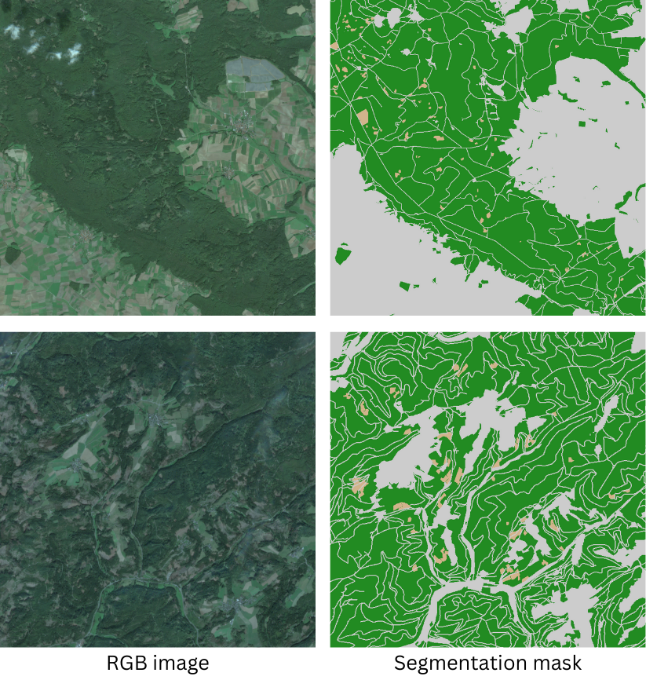
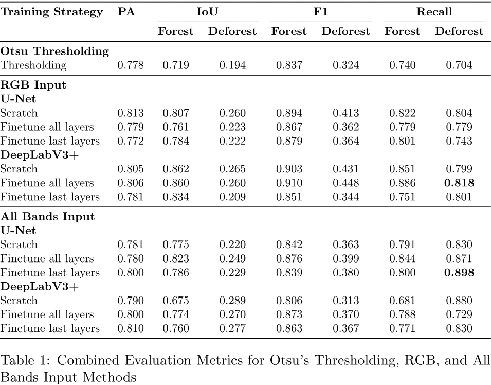
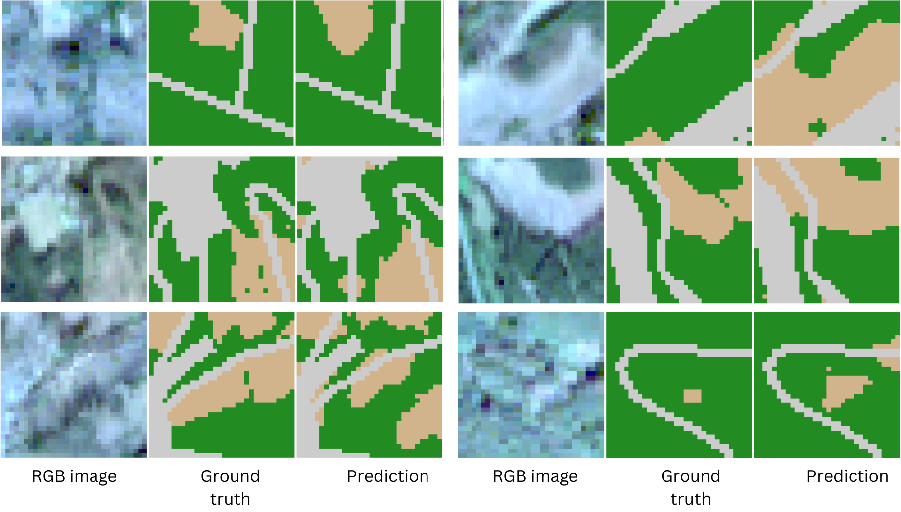

# Weakly Supervised Semantic Segmentation of Multispectral Satellite Imagery for Land Cover Mapping

This repository is the official implementation of [Weakly Supervised Semantic Segmentation of Multispectral Satellite Imagery for Land Cover Mapping](https://cloud.fiw.fhws.de/s/MYMzYoXPRjgNeYs)

## Abstract 
This thesis investigates the automation of deforestation detection using deep learning
models applied to weakly annotated multispectral data from Sentinel-2 satellite. The research
explores the performance of U-Net and DeepLabV3+ models under various training
strategies, demonstrating that deep learning methods can effectively localise deforested
areas, significantly outperforming traditional methods like Otsu thresholding. Despite
improvements in recall and Intersection over Union (IoU) metrics, the findings reveal
challenges related to model precision and the presence of false positives, emphasising the
need for improved annotation quality and training techniques. These results underscore
the complexities of leveraging multispectral data for deforestation monitoring and provide
a foundation for future enhancements in remote sensing.



## Requirements
To install requirements:

```bash
pip install -r requirements.txt
```

## Training

To train and evaluate the model(s) in this paper with default settings, run this command:
```bash
bash train.sh
```

### Custom Training Options

To customize training, you can pass parameters to `train.sh`. Here’s an example:

```bash
bash train.sh --data_dir_train </path/to/train_data> --lr 0.001 --batch_size 128 --max_epochs 50 --model "unet" 
```

| Argument                  | Description                                         | Default                   |
|---------------------------|-----------------------------------------------------|---------------------------|
| `--lr`                    | Learning rate                                       | `0.00001`                 |
| `--batch_size`            | Batch size for training                             | `256`                     |
| `--max_epochs`            | Maximum epochs                                      | `100`                     |
| `--alpha`                 | Class weights for focal loss                        | `0 0.925 0.075`           |
| `--gamma`                 | Gamma value for focal Loss                          | `2`                       |
| `--model`                 | Model architecture (`unet` or `deeplabv3+`)         | `"deeplabv3+"`            |
| `--train_mode`            | Train from scratch or use pretrained models         | `scratch`                 |
| `--pretrained_strategy`   | Finetune all layers or finetune last layers         |`fine_tune_all_layers`     |
| `--use_rgb`               | Use RGB channels                                    | `true`                    |
| `--use_nir`               | Use NIR channel                                     | `false`                   |
| `--use_swir`              | Use SWIR channels                                   | `false`                   |
| `--use_red_edge`          | Use Red edge channels                               | `false`                   |
| `--use_season`            | Use season channel                                  | `false`                   |
| `--apply_augmentations`   | Apply data augmentations                            | `true`                    |
| `--data_dir_train`        | Path to training data                               | `/path/to/train_data`     |
| `--data_dir_val`          | Path to validation data                             | `/path/to/val_data`       |


## Results
Our models achieve the following performance on UNet and Deeeplabv3+:



